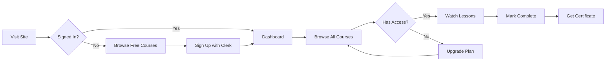
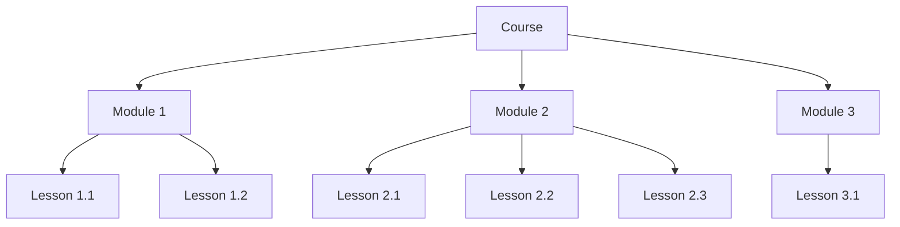
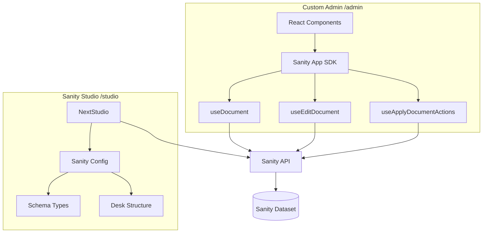
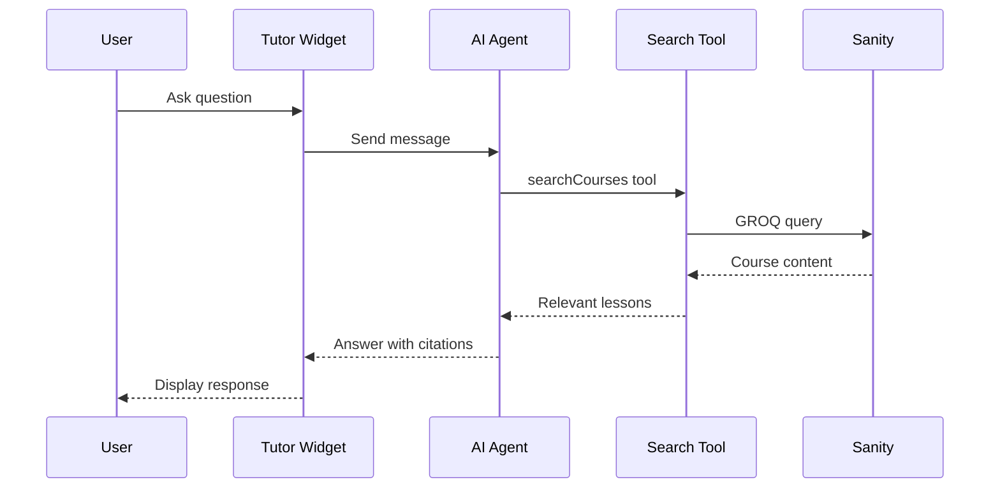

 LMS Platform

[](https://creativecommons.org/licenses/by-nc/4.0/)
[](https://nextjs.org/)
[](https://react.dev/)
[](https://www.sanity.io/)
[](https://clerk.com/)
[](https://www.mux.com/)
[](https://openai.com/)
[](https://tailwindcss.com/)

> **Learn to build production-ready LMS platforms** with modern architecture, AI-powered features, and bespoke CMS solutions.

---

<table>
<tr>
<td width="33%">

### 🎯 Who This Is For

Developers who want to learn how to build **real-world course platforms** from scratch. Perfect for:
- Aspiring full-stack developers
- Developers exploring headless CMS
- Anyone building SaaS products

</td>
<td width="33%">

### ✨ What Makes This Special

- **Custom Admin Panel** built with Sanity App SDK (not just Studio!)
- **AI Learning Assistant** powered by GPT-4o
- **Tiered Subscriptions** with Clerk billing
- **Professional Video Streaming** via Mux

</td>
<td width="33%">

### 🛠️ Technical Highlights

- Next.js 16 App Router + React 19
- Real-time content updates with Sanity SDK
- Drag-and-drop course builder
- TypeScript end-to-end with typegen
- Modern UI with Shadcn + Tailwind 4

</td>
</tr>
</table>

---

## 👇🏼 DO THIS Before You Get Started

Before diving into the code, set up accounts with these services:

### 🎁 USE THESE Links!


<table>
<tr>
<th>Service</th>
<th>What It's For</th>
<th>Get Started</th>
</tr>
<tr>
<td><strong>🟢 Sanity</strong></td>
<td>Headless CMS for all your content</td>
<td><a href="https://www.sanity.io/sonny?utm_source=youtube&utm_medium=video&utm_content=ai-lms-platform"><strong>👉 Get Started with Sanity</strong></a></td>
</tr>
<tr>
<td><strong>🔐 Clerk</strong></td>
<td>Authentication & subscription billing</td>
<td><a href="https://go.clerk.com/5fXjeWr"><strong>👉 Get Started with Clerk</strong></a></td>
</tr>
<tr>
<td><strong>🤖 CodeRabbit</strong></td>
<td>AI-powered code reviews</td>
<td><a href="https://coderabbit.link/sonny-dec"><strong>👉 Get Started with CodeRabbit</strong></a></td>
</tr>
</table>

**💡 Pro Tip:** These are the exact services used in production - you'll need them to follow along!

### Other Required Services

| Service | What It's For | Get Started |
|---------|---------------|-------------|
| **Mux** | Video hosting & streaming | 👉 [mux.com](https://www.mux.com/) |
| **OpenAI** | AI tutor functionality | 👉 [platform.openai.com](https://platform.openai.com/) |

---


This is a Learning Management System (LMS) - a platform where:
- **Creators** upload and organize video courses
- **Learners** watch lessons, track progress, and get AI-powered help
- **Admins** manage everything through a beautiful custom dashboard

### Key Concepts

| Concept | What It Means |
|---------|---------------|
| **Course** | A collection of modules on a topic (e.g., "Master React") |
| **Module** | A chapter within a course (e.g., "React Hooks Deep Dive") |
| **Lesson** | An individual video + notes (e.g., "Understanding useState") |
| **Tier** | Access level: Free, Pro ($), or Ultra ($$) |
| **AI Tutor** | Chat assistant that searches your course content to answer questions |

### Example Use Cases

- 🎓 **Online Course Platform** - Sell programming courses with subscription tiers
- 🏢 **Corporate Training** - Internal training portal for employees
- 📚 **Educational Institution** - Supplement classroom learning with video content

---


#### Custom Admin Components

- 📝 **CourseEditor** - Full course editing with modules sidebar
- 🎯 **ModuleAccordionInput** - Drag-and-drop module reordering
- 🖼️ **ImageInput** - Image upload with preview
- 🔗 **ReferenceInput** - Document reference picker
- 🏷️ **SlugInput** - Auto-generated URL slugs
- ⚡ **DocumentActions** - Publish/Unpublish/Discard/Delete

#### 🤖 AI Learning Assistant

- Powered by **GPT-4o** via Vercel AI SDK
- **Tool calling** to search course content
- Semantic search across courses, modules, and lessons
- Only available to Ultra subscribers

#### 📹 Video Streaming

- **Mux** integration for professional video hosting
- Signed playback tokens for security
- Adaptive bitrate streaming
- Thumbnail and storyboard generation

#### 🔐 Authentication & Billing

- **Clerk** handles auth, users, and subscriptions
- Pricing table component for plan selection
- Tier-based content gating
- Webhook integration for billing events

#### 📊 Progress Tracking

- Mark lessons as complete
- Track course completion percentage
- Per-user progress stored in Sanity

---

## 🔄 How It Works

### User Journey



### Content Hierarchy



### Admin vs Studio Architecture



### AI Tutor Flow



---

## 🚀 Getting Started

### Prerequisites

- **Node.js 18+** (recommend using [nvm](https://github.com/nvm-sh/nvm))
- **pnpm** (package manager)
- Accounts: Sanity, Clerk, Mux, OpenAI

### Installation

1. **Clone the repository**

```bash
git clone https://github.com/your-username/sonnys-academy.git
cd sonnys-academy
```

2. **Install dependencies**

```bash
pnpm install
```

3. **Copy environment variables**

```bash
cp .env.example .env.local
```

4. **Configure environment variables** (see below)

5. **Run development server**

```bash
pnpm dev
```

6. **Open the app**

- Main app: [http://localhost:3000](http://localhost:3000)
- Admin panel: [http://localhost:3000/admin](http://localhost:3000/admin)
- Sanity Studio: [http://localhost:3000/studio](http://localhost:3000/studio)

### Environment Variables

Create a `.env.local` file with the following variables:

```bash
# Sanity Configuration
NEXT_PUBLIC_SANITY_PROJECT_ID=your_project_id
NEXT_PUBLIC_SANITY_DATASET=production
NEXT_PUBLIC_SANITY_API_VERSION=2025-11-27

# Clerk Authentication
NEXT_PUBLIC_CLERK_PUBLISHABLE_KEY=pk_test_...
CLERK_SECRET_KEY=sk_test_...

# OpenAI (for AI Tutor)
OPENAI_API_KEY=sk-...

# Mux Video
MUX_TOKEN_ID=your_mux_token_id
MUX_TOKEN_SECRET=your_mux_token_secret
MUX_SIGNING_KEY_ID=your_signing_key_id
MUX_SIGNING_KEY_PRIVATE=your_signing_key_private
```

> ⚠️ **Security Notes:**
> - Never commit `.env.local` to version control
> - Variables starting with `NEXT_PUBLIC_` are exposed to the browser
> - Keep `CLERK_SECRET_KEY` and `MUX_SIGNING_KEY_PRIVATE` strictly server-side

